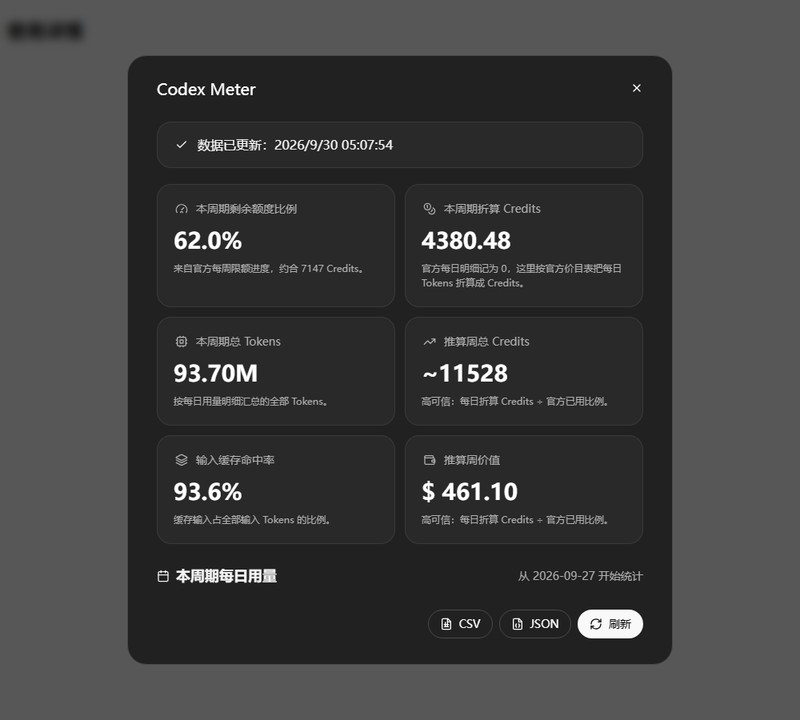

<p align="center">
  
</p>

<h1 align="center">Codex Meter（改进版）</h1>

<p align="center">
  在 ChatGPT Codex 分析页里查看周额度、Credits 和 Tokens，并按官方价目表推算整周额度。
</p>

<p align="center">
  <a href="./LICENSE"></a>
  <a href="https://github.com/Wangnov/codex-meter"></a>
  
  <a href="https://github.com/Goldfish76/codex-meter/releases/latest"></a>
</p>

<p align="center">
  <a href="#readme-cn">中文</a> · <a href="#readme-en">English</a>
</p>

> **本项目基于 [Wangnov/codex-meter](https://github.com/Wangnov/codex-meter)（作者 Jun Zhao，MIT 许可）改进。**
> 原项目最后更新于 2026 年 6 月（v0.2.19）。之后 OpenAI 调整了 Codex 的用量接口，套餐内用量在每日明细里一律记为 0 Credits，导致原版的「推算周总 Credits」和「推算周价值」永远停在「同步中」。这个版本修复了该问题，其余功能与原版一致。

> **v0.3.1 更正：** v0.3.0 把 `daily-token-usage-breakdown` 接口的数值误当成了周额度百分比。这些数值其实是相对于所查时间段内用量最多那一天的比例，所以 v0.3.0 显示的「推算周总 Credits」和「推算周价值」是错的。请升级到 v0.3.1。

<p align="center">
  
  <br>
  <sub>改进版弹窗（示例数据）</sub>
</p>

---

<a id="readme-cn"></a>

# 中文

## 目录

- [改进了什么](#改进了什么)
- [工作原理](#工作原理)
- [安装教程](#安装教程)
- [使用教程](#使用教程)
- [更新与卸载](#更新与卸载)
- [常见问题](#常见问题)
- [隐私与局限](#隐私与局限)
- [致谢与许可](#致谢与许可)

## 改进了什么

相对原版 v0.2.19：

- **按官方价目表折算每日 Credits。** 每日明细里的 Credits 虽然是 0，Tokens 仍然有记录。改进版用官方 Codex 价目表给每天的 Tokens 计价。同一天用了多个模型时，按官方「按来源」图表接口 `daily-token-usage-breakdown` 给出的各模型占比拆分。
- **恢复「推算周总 Credits」和「推算周价值」。** 公式与原版相同：本周期 Credits ÷ 官方已用比例，只是把记为 0 的 Credits 换成折算值。
- **新增显示：**
  - 「本周期剩余额度比例」下方显示剩余额度约合多少 Credits。
  - 卡片「本周期折算 Credits」。
  - 明细表的 Credits 列和折算金额列改用折算值。
  - Meter 图表在没有真实 Credits 时改用折算 Credits。
  - CSV 导出新增 `estimated_credits` 列。
- **自动退回，不会比原版更差：**
  - 遇到价目表里没有的新模型，或新接口请求失败：改为按 Tokens 推算（本周期 Tokens ÷ 官方已用比例），显示「推算周总 Tokens」和「推算剩余 Tokens」。
  - 账号有真实 Credits 记录（按 Credits 计费的套餐、或用了购买的 Credits）：沿用原版公式。
- **移除原作者的 Chrome 应用商店自动发布流程。** 本仓库不发布到商店。

## 工作原理

1. `/backend-api/wham/analytics/daily-workspace-usage-counts` 返回每天的 **Tokens**，分为未缓存输入、缓存输入和输出。套餐内用量的 Credits 在这里一律是 0。
2. `/backend-api/wham/usage/daily-token-usage-breakdown`（官方「按来源」图表用的接口）按天、按模型拆分用量。它的数值是**相对于所查时间段内用量最多那一天**的比例，不是周额度百分比，所以这里只用它来算每天各模型的占比。
3. 用[官方 Codex 价目表](https://learn.chatgpt.com/docs/pricing)给当天的 Tokens 计价。同一天用了多个模型时，按各模型的占比拆分 Tokens，这里假设各模型的 Tokens 构成相近：

   ```text
   当天折算 Credits = Σ 各模型占比 ÷ Σ（模型 m 的占比 ÷ 当天全部 Tokens 按模型 m 单价计价的 Credits）
   ```

   只用一个模型的日子，就是当天 Tokens 按该模型单价计价的 Credits。

4. 推算周总 Credits = 本周期每日折算 Credits 之和 ÷ 官方已用比例，推算周价值 = 推算周总 Credits × US$40 / 1000（沿用原项目的换算假设）。

价目表和实际消耗的对应关系，用一个个人套餐账号 37 天的数据验证过：只用 GPT-6 Astra 的日子和只用 GPT-5.6 Sol 的日子，两个模型单价相差 2.5 倍，但按价目表折算后，和接口给出的相对用量仍然成同一比例（相差不到 1%）。这说明套餐内额度的消耗与价目表成正比。

价目表写在 [`codex-meter-extension/shared/config.js`](./codex-meter-extension/shared/config.js) 的 `CREDIT_RATES` 里（2026-09-30 版本，单位为每 100 万 Tokens 的 Credits）：

| 模型 | 输入 | 缓存输入 | 输出 |
|---|---:|---:|---:|
| GPT-6 Astra | 250 | 25 | 1,250 |
| GPT-6.1 Sol | 50 | 2.5 | 250 |
| GPT-6 Sol | 50 | 5 | 250 |
| GPT-6 Luna | 2.5 | 0.25 | 12.5 |
| GPT-5.6 Sol（促销价） | 100 | 10 | 500 |
| GPT-5.6 Terra | 50 | 5 | 300 |
| GPT-5.6 Luna | 5 | 0.5 | 30 |
| GPT-5.5 | 125 | 12.5 | 750 |

套餐内用量的快速模式（Fast）按 2.5 倍、Ultrafast 按 8 倍计算。

## 安装教程

需要 Microsoft Edge 或 Google Chrome（桌面版）。整个过程约 3 分钟。

### 第 1 步：下载扩展

**方式 A：从 Releases 下载（推荐）**

1. 打开 [Releases 页面](https://github.com/Goldfish76/codex-meter/releases/latest)，在 **Assets** 里下载 `codex-meter-extension-vX.Y.Z.zip`（当前为 v0.3.1）。
2. 把它解压到一个**固定的位置**，例如 `文档\codex-meter-extension`。在 Windows 上可以右键 zip，选「全部解压缩」。解压出来的文件夹里应该直接就有 `manifest.json`。

> ⚠️ 浏览器是直接从这个文件夹加载扩展的。装好后**不要删除、移动或重命名**这个文件夹，否则扩展会失效。

**方式 B：下载源码 ZIP**

在仓库主页点绿色的 **「Code」** 按钮，再点 **「Download ZIP」**。解压后得到 `codex-meter-main` 文件夹，扩展在其中的 `codex-meter-extension` 子文件夹里。

**方式 C：用 Git 克隆**

```bash
git clone https://github.com/Goldfish76/codex-meter.git
```

### 第 2 步：停用商店版（没装过可跳过）

如果你从 Chrome 应用商店装过原版 Codex Meter，请先在扩展管理页把它的开关**关掉**。两个版本同时启用会互相干扰。可以只停用、先不删除。

### 第 3 步：加载扩展

**Microsoft Edge**

1. 在地址栏输入 `edge://extensions` 并回车。
2. 打开左侧栏底部的 **「开发人员模式」** 开关。
3. 点页面上方出现的 **「加载解压缩的扩展」**。
4. 选择里面直接有 `manifest.json` 的那个文件夹：
   - Releases 方式：第 1 步解压出来的文件夹
   - 源码 ZIP 方式：`codex-meter-main\codex-meter-extension`
   - Git 方式：`codex-meter\codex-meter-extension`
5. 列表里出现 **Codex Meter 0.3.1**，并且开关是打开的，就装好了。

**Google Chrome**

1. 在地址栏输入 `chrome://extensions` 并回车。
2. 打开右上角的 **「开发者模式」** 开关。
3. 点左上角的 **「加载已解压的扩展程序」**。
4. 同样选择里面直接有 `manifest.json` 的那个文件夹。
5. 列表里出现 **Codex Meter 0.3.1**，就装好了。

### 第 4 步：固定到工具栏（可选）

- **Edge：** 点工具栏的拼图图标（扩展），再点 Codex Meter 旁边的眼睛图标（在工具栏中显示）。
- **Chrome：** 点工具栏的拼图图标，再点 Codex Meter 旁边的图钉图标。

## 使用教程

### 打开弹窗

1. 登录 ChatGPT，打开 <https://chatgpt.com/codex/cloud/settings/analytics>。如果装扩展之前页面已经开着，先刷新一次。
2. 在「使用详情」右侧点 **「Codex Meter」** 按钮。
3. 弹窗会自动读取数据，之后可以随时点 **「刷新」** 重新读取。

### 看懂各张卡片

| 卡片 | 含义 |
|---|---|
| 本周期剩余额度比例 | 官方周额度的剩余百分比（实时）。下方小字是剩余额度约合多少 Credits。 |
| 本周期折算 Credits | 本周期每日 Tokens 按价目表折算的 Credits 合计。每日明细通常比官方比例**滞后几个小时**，最近的用量可能还没算进来。 |
| 本周期总 Tokens | 本周期每日明细的 Tokens 合计。 |
| 推算周总 Credits | 本周期折算 Credits ÷ 官方已用比例。前缀的「高 / 中 / 低可信」：已用不到 10%、周期开始不到 8 小时、或本周期数据明显不完整时为低，已用不到 20% 或周期开始不到 24 小时为中。 |
| 输入缓存命中率 | 缓存输入 Tokens 占全部输入 Tokens 的比例。 |
| 推算周价值 | 推算周总 Credits × US$40 / 1000。 |

- 如果显示的是「推算周总 Tokens」和「推算剩余 Tokens」，说明你用了价目表里还没有的新模型，或者新接口暂时不可用。这时改为按 Tokens 推算：本周期 Tokens ÷ 官方已用比例。结果会随模型组合变化。
- 如果显示的是「本周期已用 Credits」，说明你的账号有真实 Credits 记录，这时使用原版公式：本周期 Credits ÷ 官方已用比例。

### 明细表

分为「本周期每日用量」和「周期外历史用量」两张表，列依次为：日期、折算 Credits（账号有真实 Credits 时显示 Credits）、总 Tokens、输入 Tokens、缓存命中、折算金额、轮数。

### Meter 图表

在官方「按来源」图表旁边切换到 **「Meter」**，可以按 Credits、总 Tokens、折算金额、轮数查看每天或每周的用量。图表跟随页面顶部的时间范围和分组方式。

### 导出与管理

- 弹窗底部的 **CSV / JSON** 按钮导出最近一次的数据。CSV 包含 `estimated_credits`（折算 Credits）列。
- 点工具栏上的 Codex Meter 图标打开管理面板，可以开关「页面内按钮」和「图表控制」、设置「默认图表」（官方或 Meter），以及查看「本地快照」、导出 JSON 或清空历史。

## 更新与卸载

**更新**

- Releases 或源码 ZIP 方式：下载新版本，把文件解压覆盖到原来的文件夹里（路径保持不变）。然后在扩展管理页，Edge 点 Codex Meter 卡片上的 **「重新加载」**，Chrome 点卡片上的刷新图标。
- Git 方式：在仓库目录运行下面的命令，再同样点「重新加载」：

  ```bash
  git pull
  ```

**卸载**

在扩展管理页点 Codex Meter 卡片上的 **「删除」**（Edge）或 **「移除」**（Chrome），再删除下载的文件夹即可。

## 常见问题

**看不到 Codex Meter 按钮？**

- 确认打开的是 `https://chatgpt.com/codex/cloud/settings/analytics`，并且已经登录。
- 刷新一次页面。
- 确认扩展管理页里 Codex Meter 的开关是打开的，并且商店版已经停用。
- 点工具栏的 Codex Meter 图标，确认「页面内按钮」是打开的。

**一直显示「同步中」？**

说明这个周期还没有用量（例如刚重置）。用过之后再点「刷新」。

**「推算周总 Credits」看起来偏低？**

每日明细比官方比例滞后几个小时：官方比例已经算上了刚用掉的额度，每日明细里还没有。过几个小时再点「刷新」，推算值会回升。前缀显示「低可信」时尤其如此。

**浏览器启动时提示停用开发者模式的扩展？**

如果出现这样的提示，关掉提示即可，不要点「停用」。

**OpenAI 更新了价目表或推出了新模型？**

修改 [`codex-meter-extension/shared/config.js`](./codex-meter-extension/shared/config.js) 里的 `CREDIT_RATES`，然后在扩展管理页点「重新加载」。也欢迎提交 Issue 或 PR。

## 隐私与局限

**隐私**

- 不需要额外登录，也**不保存** ChatGPT 网页的登录 token。刷新数据时，只在当前页面内使用页面已有的鉴权信息。
- 只请求 chatgpt.com 自己的接口：`/backend-api/wham/usage`、`/backend-api/wham/analytics/daily-workspace-usage-counts`、`/backend-api/wham/usage/daily-token-usage-breakdown`。
- 快照只保存在本机浏览器的 `chrome.storage.local`。不加载任何远程脚本。

**局限**

- 这不是 OpenAI 官方项目，依赖 ChatGPT 网页的私有接口。OpenAI 调整接口后可能需要适配。
- 官方说明价目表本身并不决定套餐内额度。本扩展的换算是根据每日明细反推出来的**经验估计**，不是官方数字。
- 价目表会变化。例如 GPT-5.6 Sol 目前是促销价（至少到 2026-11-21），GPT-5.5 将于 2026-10-14 下线。价格变化后需要更新 `CREDIT_RATES`。
- 多个模型混用的日子，假设各模型的 Tokens 构成相近，会有一定误差。
- 每日明细比官方比例滞后几个小时。周期刚开始，或刚集中用掉大量额度时，推算值会偏低。
- US$40 / 1000 Credits 是原项目的换算假设，仅作参考。

## 开发

扩展没有构建步骤，是纯 MV3 项目，代码在 `codex-meter-extension/` 目录。分层说明见 [ARCHITECTURE.md](./codex-meter-extension/ARCHITECTURE.md)。

```bash
# JS 语法检查（需要 Node.js）
find codex-meter-extension -name '*.js' -maxdepth 3 -print0 | xargs -0 -n1 node --check

# manifest 检查
node -e "JSON.parse(require('fs').readFileSync('codex-meter-extension/manifest.json','utf8'))"
```

## 致谢与许可

- 原项目：[Wangnov/codex-meter](https://github.com/Wangnov/codex-meter)，作者 Jun Zhao。感谢原作者的全部工作，本仓库的大部分代码和界面都来自原项目。
- 本仓库以 [MIT License](./LICENSE) 发布，并保留原项目的版权声明。
- 本项目不是 OpenAI 官方项目，也不与 OpenAI 存在隶属关系。

---

<a id="readme-en"></a>

# English

**Codex Meter (improved fork)** is a local Chrome / Edge extension for the ChatGPT Codex analytics page. It is based on [Wangnov/codex-meter](https://github.com/Wangnov/codex-meter) by Jun Zhao (MIT), which has not been updated since June 2026 (v0.2.19).

## Why this fork

The daily usage endpoint now reports `credits: 0` for usage covered by the plan, so the original "Projected weekly Credits" and "Projected weekly value" cards stay on "Syncing" forever. This fork:

- Prices each day's tokens with the [official Codex rate card](https://learn.chatgpt.com/docs/pricing). When a day mixes models, the tokens are split by each model's share from `/backend-api/wham/usage/daily-token-usage-breakdown`, the endpoint behind the official "by source" chart. Its values are relative to the busiest day of the requested range, not to the weekly limit, so only the per-model shares are used.
- Restores "Projected weekly Credits" and "Projected weekly value" with the original formula (cycle Credits ÷ official used percent), using the estimated Credits.
- Adds:
  - remaining Credits under the remaining-percent card
  - an "Estimated Credits this cycle" card
  - estimated Credits and value in the daily tables and the Meter chart
  - an `estimated_credits` CSV column
- Falls back to token-based projections (cycle Tokens ÷ official used percent) for models missing from the rate card, or when the breakdown endpoint fails. Accounts that report real Credits keep the original formula.
- Removes the original author's Chrome Web Store publishing workflow.

> **v0.3.1 correction:** v0.3.0 treated the breakdown values as percent of the weekly limit. They are relative to the busiest day of the requested range, so the projected weekly Credits and value in v0.3.0 were wrong. Please update to v0.3.1.

## Install

1. Download `codex-meter-extension-vX.Y.Z.zip` from the [latest release](https://github.com/Goldfish76/codex-meter/releases/latest) and unzip it to a permanent folder. You can also use **Code → Download ZIP** or `git clone https://github.com/Goldfish76/codex-meter.git`.
2. If you installed the original Codex Meter from the Chrome Web Store, turn it off first.
3. Open `edge://extensions` (Edge) or `chrome://extensions` (Chrome) and turn on **Developer mode**.
4. Click **Load unpacked** and select the folder that directly contains `manifest.json`.

Keep the folder in place after installing. The browser loads the extension from it.

## Use

1. Open <https://chatgpt.com/codex/cloud/settings/analytics> while signed in. Refresh the page once if it was already open.
2. Click **Codex Meter** beside Usage details.
3. Read the cards, the daily tables, and the **Meter** chart. Export CSV / JSON from the modal.

To update, download again (or `git pull`) and click **Reload** on the extension card.

## Limits

This is an unofficial tool that depends on private ChatGPT Web endpoints. The Credit conversion is an empirical estimate derived from the daily breakdown, not an official number. OpenAI states that credit prices alone do not determine included usage. The rate card in `codex-meter-extension/shared/config.js` needs updating when prices or models change. Daily details lag the official percent by a few hours, so projections early in a cycle or right after heavy use read low. US$40 per 1,000 Credits is the original project's assumption.

## License

MIT. The original copyright notice by Jun Zhao is kept in [LICENSE](./LICENSE). This project is not affiliated with OpenAI.
